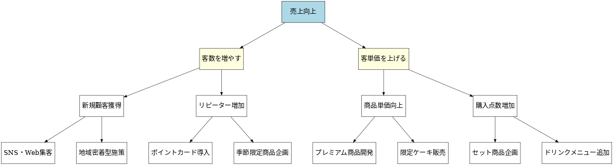
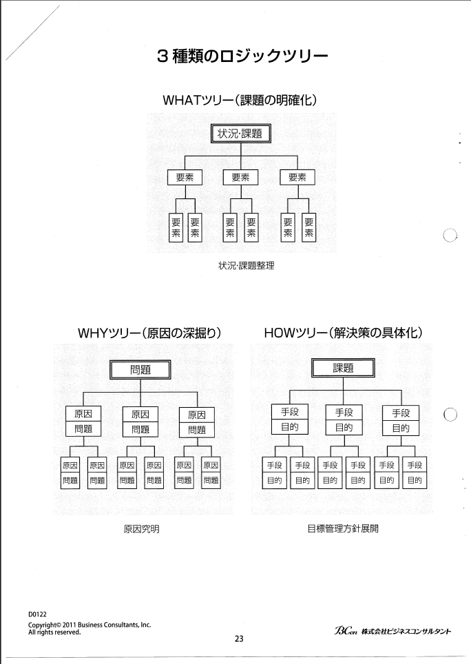
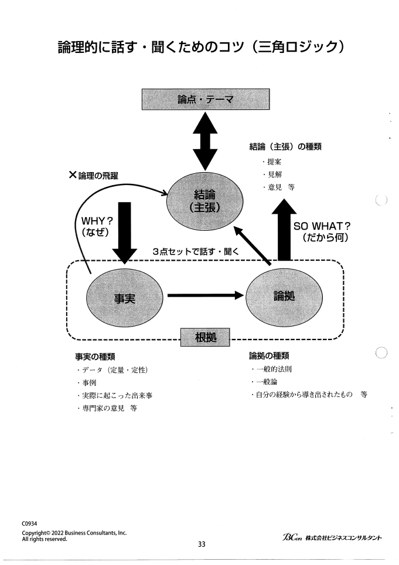
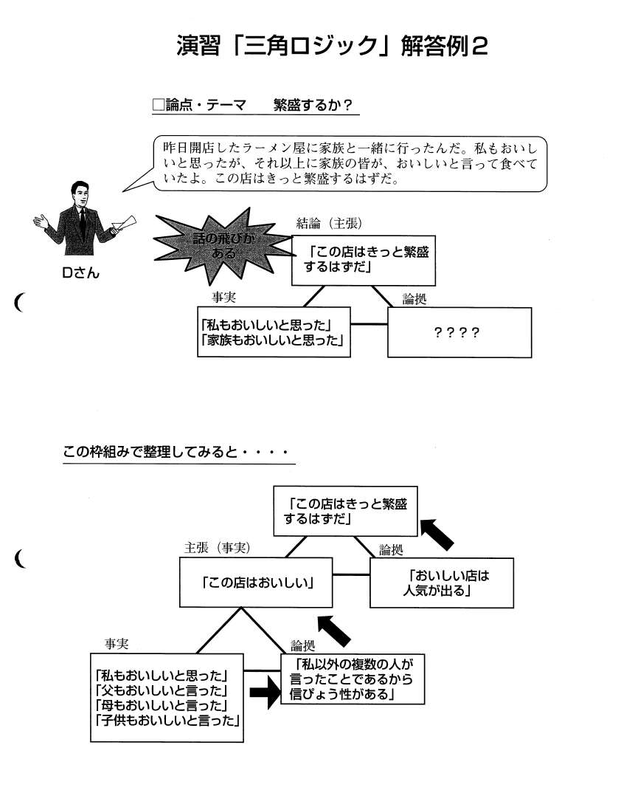
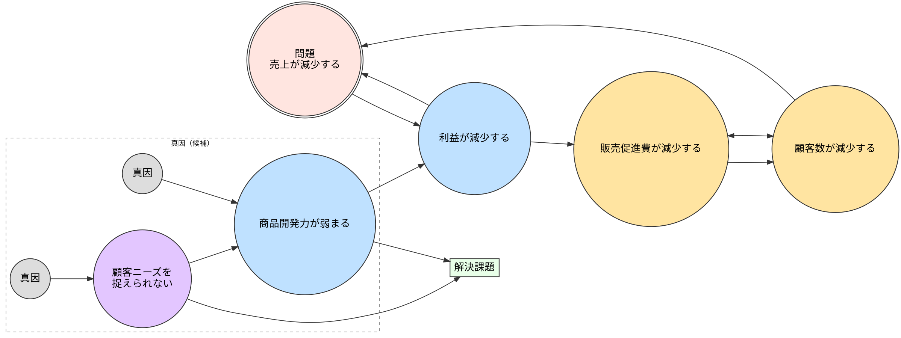

# 階層別研修報告

**ビジネスシンキングプログラム**
ヒダルゴダイアン
2025 年 10 月 6 日

---

## 今日お話しすること

- 研修概要と目的
- 論理思考とは
- ビジネスシンキングの手法
  - 情報を「分ける」手法（4 つ）
  - 論理を「つなげる」手法
  - 因果関係の体系化
- まとめ

---

## 研修概要

**プログラム名：ビジネスシンキングプログラム**
期間：2 日間

### 研修の目的

1. 論理的に物事を考える方法を学ぶ
2. 情報を適切に整理し、他者に分かりやすく伝える力を身につける

---

## 論理思考とは

ビジネスに求められるスキルとして論理とは何かを理解するために、以下のように簡便法で定義します。

- 説明できること
- 裏付ける根拠があること
- 思考が矛盾していないこと

**大前提**

> 「論理的であることが目的にかなっている場合のみ有効」

---

## 学習した手法

| 情報を「分ける」手法 | 論理を「つなげる」手法 | 問題を分析する手法  |
| :------------------- | :--------------------- | :------------------ |
| 1. グルーピング      | 5. 三角ロジック        | 6. 因果関係の体系化 |
| 2. MECE              |                        |                     |
| 3. ロジックツリー    |                        |                     |
| 4. マトリックス      |                        |                     |

---

## 1. グルーピング

情報のかたまりを何らかの基準で分けること

**例：買い物リストの整理**

> 課題: あなたは出勤前に母から下記の買い物を頼まれました。何らかの基準でグルーピングして整理してください。
> 母親からの依頼: 「風邪で熱があるから今日は買い物にいけない。帰りにバナナと洗剤と風邪薬と、のど飴を買ってきて。それから明日お客さんがくるから缶ビール 1 ダースおとポテトチップスとメロンとクッキー、咳が出るといけないからマスクも買ってきてくれる！」

**⬇ グルーピング**

- **基準 1: 商品カテゴリ別**
  - 食べ物・飲み物: バナナ、缶ビール、ポテトチップス、メロン、クッキー
  - 生活用品: 洗剤
  - 薬・ヘルスケア: 風邪薬、マスク
- **基準 2: 緊急度別**
  - 急ぎのもの: 風邪薬、マスク
  - 普通: バナナ、メロン、洗剤
  - 急がないもの: 缶ビール、ポテトチップス、クッキー
- **基準 3: 店舗の売り場別**
  - 食品売り場: バナナ、メロン、ポテトチップス、クッキー
  - 酒類売り場: 缶ビール
  - 日用品売り場: 洗剤
  - 薬局・ヘルスケア売り場: 風邪薬、マスク
- **基準 4: 重量別**
  - 重いもの: 缶ビール 1 ダース、洗剤
  - 中程度: メロン
  - 軽いもの: バナナ、ポテトチップス、クッキー、風邪薬、マスク

> 同じ情報でも基準を変えることで、異なる視点から整理できる。目的に応じて最適な基準を選ぶことが重要。

---

## 2. MECE（ミーシー）

漏れなく重複なく分けること

- **Mutually Exclusive**（重複がない）
- **Collectively Exhaustive**（漏れがない）

**例：自宅にある家電製品を MECE で分類する**

- 台所製品：炊飯器、冷蔵庫、食器洗い乾燥機、オーブンレンジ、コーヒーメーカー
- 居間・寝室製品：テレビ、掃除機、除湿機、ステレオ、エアコン、ミシン、アイロン
- 洗面所製品：洗濯機、ドライヤー、ひげそり

> 重複も漏れもなく、きれいに分類

---

## 3. ロジックツリー

MECE を使って、複数の階層で情報を具体化していくこと

**例：ケーキ店の売上向上策**



> 売上 = 客数 × 客単価 の公式に基づいて体系的に分解。階層を下げるごとに具体的なアクションが見えてくる。

---

## 3 種類のロジックツリー



---

## 4. マトリックス

複数の情報を位置関係で整理すること

**例：重要性と緊急性のマトリックス - 営業チームの業務整理**

|            | 緊急性: 高                                                                                               | 緊急性: 低                                                                                           |
| :--------- | :------------------------------------------------------------------------------------------------------- | :--------------------------------------------------------------------------------------------------- |
| 重要性: 高 | **A 領域：すぐやる**<br>・大口顧客からのクレーム対応<br>・今月末締切の提案書作成<br>・重要会議の資料準備 | **B 領域：計画してやる**<br>・来期の営業戦略立案<br>・新商品の市場調査<br>・チームメンバーの育成計画 |
| 重要性: 低 | **C 領域：人に任せる**<br>・定型的な顧客への連絡<br>・会議の議事録作成<br>・資料の印刷・配布             | **D 領域：やらない**<br>・長すぎる会議への参加<br>・目的不明な飲み会<br>・意味のない資料整理         |

**各領域の対策**

- A 領域: シフトできないか？効率化できないか？
- B 領域: 優先できないか？時間を確保できないか？
- C 領域: 委任できないか？システム化できないか？
- D 領域: 削減できないか？やめられないか？

---

## 5. 三角ロジック

主張、事実、論拠の 3 つで論理的な筋道を作る手法

```
主張：コーヒーの値段が上がるだろう
│
├─ 事実：コーヒー豆が不作であった
└─ 論拠：原材料不足は、その加工食品の値上がりの原因になる
```

- 主張：結論、言いたいこと、クレーム
- 事実：現象、事例、統計データ
- 論拠：一般原則、前提、理由付け

---

## 論理的に話す・聞くためのコツ



---

## 三角ロジック - 例 ②



> この構造で話すと、相手に論理的に伝わりやすくなる

---

## 因果関係の分析とは

事象の原因と結果の構造を明らかにする方法

**ビジネスにおける重要性**

> ビジネスで表出している問題点の多くは、単に「望ましくない事象」が見えているだけのことが多いものです。実際には、その見えているものが問題なのではなく、その根源となっている別の事象が存在することがあります。

### 因果関係分析のプロセス

1. 表出している事象間の関係を調べる
2. 論理的飛躍がある場合は補う仮説を加える
3. 関係性を構築し、現実に起きている事象の構造を把握
4. 本質的な原因を調べ、その原因を解消するような問題解決策を講じる

> ⚠ 重要：表面的な問題ではなく、根本的な原因を見つけることが目的

---

## 因果関係の分析 - 実例

**実例：カフェチェーンの顧客満足度低下問題**

- 表面的な問題（見えている事象）
  - 顧客満足度が低下している

⬇ 因果関係を分析

- 現象：待ち時間が長い ← 原因 ❶：レジが混雑している
- 原因 ❶：レジが混雑している ← 原因 ❷：スタッフ数が不足
- 原因 ❷：スタッフ数が不足 ← 根本原因：採用予算が削減された

| 表面的な対策                           | 根本的な対策                                                   |
| :------------------------------------- | :------------------------------------------------------------- |
| 顧客にお詫びする<br>→ 問題は解決しない | 採用予算を見直す<br>シフト配置を最適化する<br>→ 根本原因を解消 |

---

## 因果関係の体系化とは

複数の原因が絡み合っている場合の全体像を把握する

**なぜ体系化が必要か？**

> 複数の原因が明らかになった時点で、即問題の原因を取り除こうとしても、必ずしも有効な解決策にならないことがあります。
> 原因と原因の間にあるさまざまな因果関係を体系化して、発生源になっていることや、特に関係が密接なことを一つの固まりとして捉えて対策事項を明確にすることが必要です。

### 体系化の 2 つのアプローチ

1. 因果関係の見える化：問題とその原因の関係を図で整理する
2. 因果関係 MAP：複数の原因が絡み合っている場合の全体像を把握し、真の原因を特定する

---

## 因果関係の体系化 - 実例

**実例：小売チェーンの売上低下問題**

- 問題：売上が 3 年連続で減少している

⬇ 因果関係 MAP で体系化



### 体系化による気づき

- 要因はつながっている：ひとつの問題が他にも影響して悪循環になる
- 改善のポイントが分かる：「商品開発力」や「顧客ニーズ」を強化すれば流れが変えられる
- 悪循環を断ち切れる：1 つを改善すると全体にプラスの効果が広がる

| 個別に見た場合                                                               | 体系化した場合                                                               |
| :--------------------------------------------------------------------------- | :--------------------------------------------------------------------------- |
| 問題をバラバラに対処する<br>根本的な解決にならない<br>同じ問題が繰り返される | 因果関係の全体像が分かる<br>改善すべき場所が見える<br>持続的な解決につながる |

---

## まとめ

- 論理思考は特別なものではなく、学べるスキル
- 「分ける」と「つなげる」の 2 つの基本動作を意識
- 日々の業務で少しずつ活用
- チーム全体での情報共有や議論の質向上を目指す
